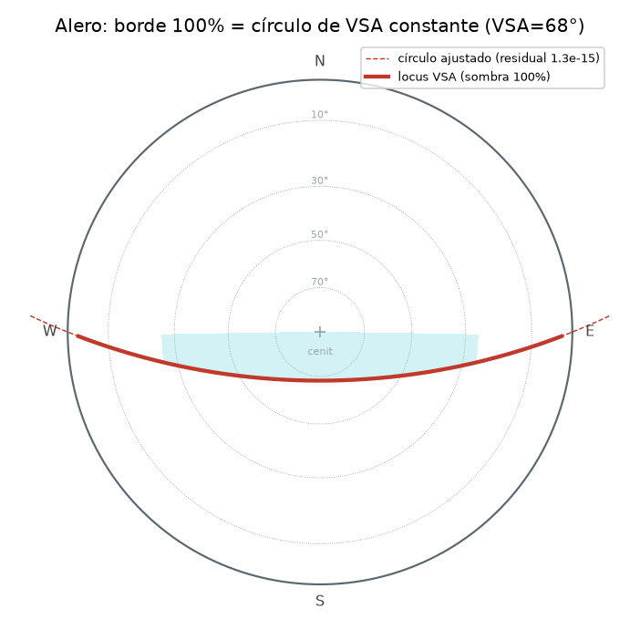
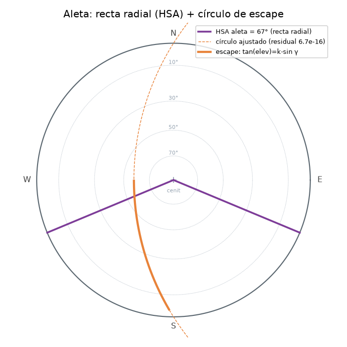
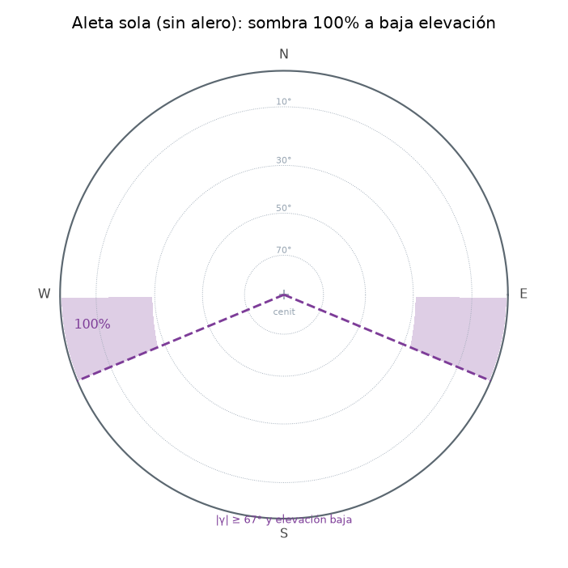
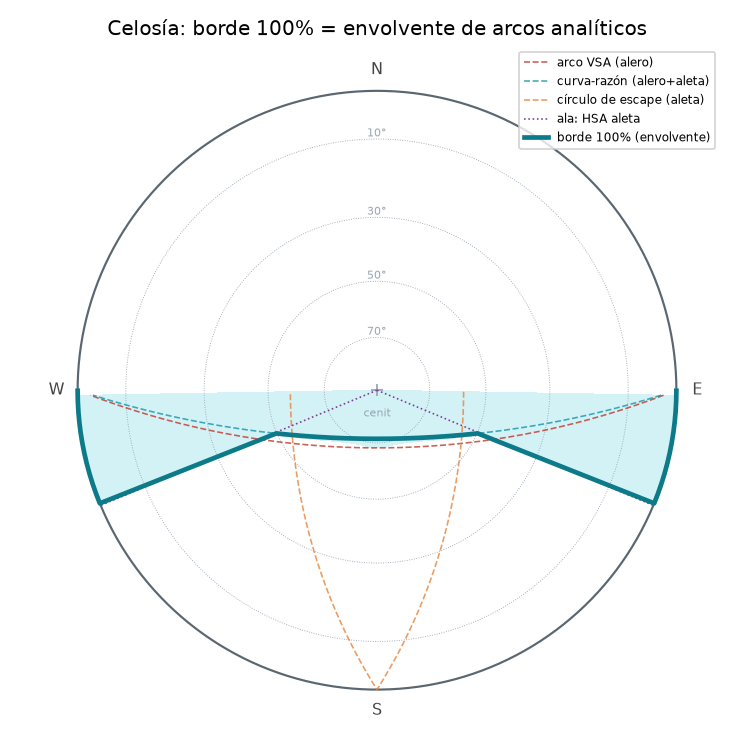
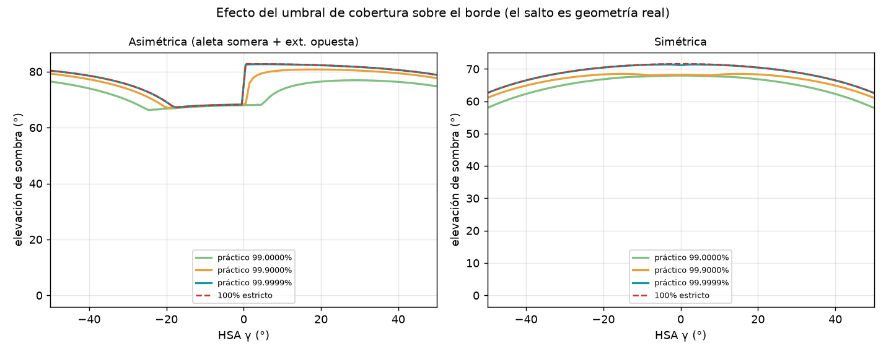
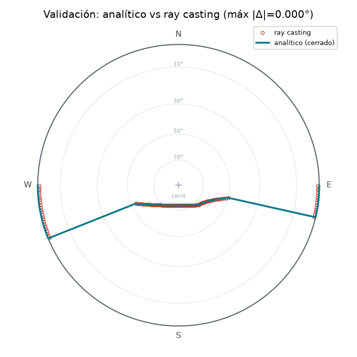

# Metodología: trazado analítico del borde de sombra 100%

¿Se puede dibujar la frontera de **sombra total (100 %)** de una protección solar en la carta
estereográfica con una **fórmula cerrada**, sin trazado de rayos? Para un **alero horizontal**
es clásico que sí. Para **aletas verticales** y para la **celosía** combinada se solía recurrir
al ray casting. Este documento muestra que **toda la frontera se compone de curvas analíticas**
(círculos y rectas), deriva la forma cerrada para la celosía completa y la valida contra el ray
casting.

> Reproducir las figuras: `uv run python docs/figuras_metodologia.py` (escribe en `docs/assets/`).

## 1. Convenciones y proyección

Ventana vertical de ancho `W` y alto `H`, con coordenadas locales `x∈[0,W]`, `y∈[0,H]`
(`y=0` = antepecho). El Sol relativo a la ventana se describe por:

- **HSA** `γ` = azimut solar − azimut de la pared (ilumina si `|γ|<90°`).
- **VSA** (ángulo de perfil): `tan(VSA) = tan(elevación)/cos γ`.

Usamos `t = tan(VSA) = tan(elev)/cos γ` y `m = tan γ`. Proyección estereográfica
`r = tan((90°−elev)/2)` (cenit al centro `r=0`, horizonte `r=1`); el punto se coloca en el
azimut `pared+γ`. Es **conforme**: mapea muchos lugares geométricos a **círculos**.

## 2. Recapitulación horizontal (alero) — exacto y conocido

Un alero sombrea el 100 % de la ventana cuando `VSA ≥ VSA_corte = arctan((H+offset)/depth)`.
El **locus de VSA constante** proyecta a un **círculo exacto** (lo verificamos: residual de
ajuste ~1e‑16). La **extensión lateral** del alero añade un segundo corte: el "círculo lateral"
`tan(elev) = (H+offset)·sin γ / ext`, que **también es un círculo exacto**. La frontera solo‑alero
es el **máximo** (envolvente) de ambos.

## 3. El dual vertical (aleta)

Por dualidad alero↔aleta, VSA↔HSA:

- La aleta cubre **todo el ancho** cuando `γ ≥ arctan(W/fin)` → en la estereográfica es una
  **recta radial** (corte HSA). Para una aleta de altura infinita, eso bastaría.
- Una aleta **finita** deja escapar el rayo por **encima** de su borde superior. Esa condición es
  `tan(elev) = (H+ext_top)·sin γ / W` → de nuevo un **círculo exacto** (mismo tipo que el círculo
  lateral del alero).

Por tanto, la **aleta sola** queda 100 % sombreada en `{γ ≥ arctan(W/fin)} ∩ {tan(elev) ≤
(ext_top/W)·sin γ}`: una región de **baja elevación** (la aleta sombrea menos cuanto más alto el
Sol) y solo si `ext_top > 0`. Las primitivas son analíticas — la hipótesis "lo vertical no se
puede analítico" **no se sostiene a nivel de primitivas**.

## 4. Por qué la combinación necesita una envolvente

Lo genuinamente difícil es la **celosía**: cuando ni el alero ni la aleta sombrean al 100 % por
separado pero **juntos sí**. La unión de sus sombras no es un único lugar geométrico.

**Linchpin (verificado numéricamente):** la ventana queda 100 % sombreada ⟺ su **arista inferior
`y=0`** queda cubierta (el umbral calculado solo en `y=0` coincide con el ray casting completo a
**0.055°** = el paso del barrido). En `y=0`, con `top=H+offset` (caso `γ>0`):

- el alero cubre desde un lado hasta `P = min(W, W+ext − m·top/t)`;
- la aleta cubre desde `Q = max(0, W − m·μ)`, con `μ = min(fin, (H+ext_top)/t)`.

La ventana se cubre cuando **`P ≥ Q`**. Como añadir un dispositivo **solo puede bajar** el umbral,
`elev_full(γ)` es el **mínimo** sobre los mecanismos de cubrimiento, cada uno una curva analítica:

| Mecanismo | Curva | Tipo |
|---|---|---|
| Alero solo cubre el ancho (`P=W`) | `tan(elev)=tan(VSA_corte)·cos γ` ∪ `tan(elev)=top·sin γ/ext` | círculos |
| Aleta sola cubre el ancho (`Q=0`) | `γ ≥ arctan(W/fin)` → **ala** (100 % a toda elevación) | recta radial |
| Alero + aleta se tocan (`P=Q`) | `tan(elev)=top·sin γ·cos γ /(fin·sin γ + ext·cos γ)` ("curva‑razón") | — |

(El subrégimen de "escape" de la aleta en `P=Q` solo aparece si `offset>ext_top`.) La frontera de
la celosía es la **envolvente** (mínimo por γ) de estas piezas:

La "curva‑razón" **no** es, en general, uno de los dos tipos de círculo (es una razón de
polinomios trigonométricos); el script reporta su residual de ajuste a círculo. Pero el método
**no depende** de ello: cada γ se resuelve en forma cerrada.

## 5. Resultado en forma cerrada

`solar.shading.full_shade_boundary_analytic(...)` evalúa, por cada γ (malla **par** para evitar
la singularidad de medida cero en `γ=0`), el mínimo de los mecanismos anteriores —sin bisección
ni barrido de filas— y devuelve `(gamma, elev_full)`. La región sombreada es `elev ≥ elev_full`;
`90°` donde no se alcanza el 100 %. El ray casting `full_shade_boundary(...)` se conserva como
referencia. La app ofrece un selector con **tres** máscaras (ver §5.1).

### 5.1 100 % estricto vs. borde práctico — el efecto del umbral de cobertura

El 100 % **estricto** (que *todo* punto esté en sombra) es hipersensible a franjas diminutas. En
configuraciones **asimétricas con un dispositivo débil** (p. ej. extensión de un lado + aleta
*somera* del otro, sin extensión en ese lado) el umbral **salta** en `γ=0`: de un lado lo cierra la
extensión a un VSA bajo (~68°), del otro la aleta somera deja una franja del 1‑2 % del borde que
solo se cierra con el Sol casi vertical (~83°). El salto es **geometría real** —idéntico en el
analítico, el ray casting y la fuerza bruta (malla densa)— y de hecho informa que esa aleta es poco
efectiva. Pero para diseño es engañoso: "99.99 % sombreado" es indistinguible de "100 %".

Por eso la máscara por defecto es el **borde práctico**
`solar.shading.practical_shade_boundary(..., coverage=0.999999)`: la iso‑curva de **cobertura de
área**, calculada con el mismo motor exacto‑en‑x (`shaded_fraction`) por bisección en elevación.

**El efecto** (figura abajo): al subir la cobertura hacia 100 %,

- en una protección **simétrica/normal**, el borde práctico **converge al 100 % real y se mantiene
  suave** a cualquier cobertura (no hay franjas asimétricas que perseguir);
- en una **asimétrica con dispositivo débil**, el **salto reaparece** progresivamente conforme la
  cobertura → 100 % (porque la franja expuesta es real).

| Cobertura (config asimétrica) | Salto en γ=0 | Aspecto |
|---|---:|---|
| 99 % | ~1.5° | suave |
| 99.9 % | ~7.5° | empieza a saltar |
| **99.9999 %** | ~14.3° | ≈ 100 % estricto |
| 100 % estricto | ~14.6° | salta |

Fijamos **99.9999 %**: da prácticamente el borde 100 % real, suave en el caso normal, y solo
revela el salto cuando éste es geometría real (asimetría con dispositivo débil). La app expone tres
máscaras: **práctico (99.9999 %)** · **100 % analítico** · **100 % ray casting** — las dos últimas
para inspeccionar la metodología y los saltos exactos del 100 % estricto.

## 6. Validación

`full_shade_boundary_analytic` coincide con el ray casting en la región significativa a
**< 0.01°** (el residual de `0.5°` que aparece en el ala es solo el piso de bisección del ray
casting, donde el analítico es de hecho más exacto: `elev=0`). También se contrasta contra la
cobertura de **área densa** (`shaded_fraction`, malla 400×400): justo dentro del borde la ventana
está 100 % sombreada y justo afuera no.

Tests: `test_analytic_boundary_matches_raycasting`, `test_analytic_boundary_is_true_locus`,
`test_analytic_boundary_regimes_and_edges` (ver [`../TESTS.md`](../TESTS.md)).

## 7. Casos límite y alcance

- **`γ=0`** (Sol de frente): la aleta no proyecta sombra (de canto); manda solo el alero. Es una
  singularidad de medida cero → la malla par en γ evita dibujar la "aguja".
- **Topología invertida (`depth=0`, solo aletas):** sin alero que tape arriba, la aleta sombrea el
  100 % solo a **baja** elevación (intervalo *inferior*), que la representación `elev_full`
  (intervalo *superior*) no captura; ese caso degenerado queda fuera de alcance (devuelve `90°`,
  como el ray casting). La celosía real siempre tiene `depth>0`.
- **Estabilidad numérica:** divisiones por `sin γ`, `cos γ`, `t`, `ext`, `fin` se protegen con
  `np.errstate` + `np.where` (nunca NaN en la salida).

## Conclusión

La hipótesis se matiza: **las primitivas de la protección vertical sí son analíticas** (recta
radial + círculo de escape), y la frontera 100 % de la **celosía completa** se obtiene en
**forma cerrada** como **envolvente de arcos**, validada contra el ray casting. El trazado de
rayos no era *necesario* para la frontera — era el atajo general; la metodología analítica lo
reproduce de forma exacta y más rápida.
